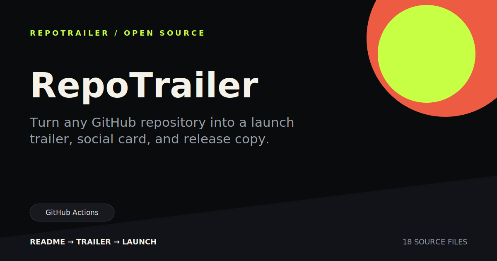

<p align="center">
  <strong>README → TRAILER → LAUNCH</strong>
</p>

<h1 align="center">RepoTrailer</h1>

<p align="center">
  Turn any GitHub repository into a launch trailer, social card, and release
  copy. One command. No API key.
</p>

<p align="center">
  <a href="https://github.com/howong217-ui/repotrailer/actions/workflows/ci.yml"></a>
  
  <a href="LICENSE"></a>
  
</p>

<p align="center">
  
</p>

Your project may be useful. Its README may even be good. That does not mean
someone scrolling a launch feed will feel why it matters.

RepoTrailer reads the repository itself, finds the real pitch, features,
technology signals, install command, and git history, then builds a compact
launch kit:

- a scene-by-scene browser preview
- a 1200×630 social card
- short launch copy and a Show HN draft
- a source-grounded JSON storyboard
- an 18–25 second MP4 trailer rendered with HyperFrames

It never needs an LLM to invent the story, and it never invents stars,
downloads, benchmarks, or adoption numbers.

## Quick start

Run the CLI directly from GitHub:

```bash
npx --yes --package=github:howong217-ui/repotrailer repotrailer .
```

The default command generates the full kit and renders `trailer.mp4`. For the
fast static pass only:

```bash
npx --yes --package=github:howong217-ui/repotrailer repotrailer . --no-video
```

Point it at any public GitHub repository:

```bash
npx --yes --package=github:howong217-ui/repotrailer repotrailer owner/repo
npx --yes --package=github:howong217-ui/repotrailer repotrailer https://github.com/owner/repo
```

During development from a checkout:

```bash
node bin/repotrailer.js . --out ./repotrailer-out --no-video
```

Open `repotrailer-out/index.html`.

## What you get

| File | Purpose |
|---|---|
| `index.html` | Responsive scene preview before spending time rendering |
| `social-card.svg` | README hero, Open Graph image, and launch graphic |
| `launch-copy.md` | Short post, Show HN draft, README snippet, and topics |
| `repotrailer.json` | Auditable repository facts, palette, and timed storyboard |
| `hyperframes/` | Editable HyperFrames HTML composition and visual identity |
| `trailer.mp4` | 1920×1080 HyperFrames render at 30fps |

<p align="center">
  
</p>

<p align="center"><em>Generated by RepoTrailer from this repository.</em></p>

If RepoTrailer saves you a launch asset or helps explain a repository faster,
star the project so the next release can focus on the workflows people actually
use.

## Why this one

**Local-first.** Local repositories stay local. Public GitHub URLs are cloned
to a temporary directory.

**No API key.** The first useful result does not depend on OpenAI, Anthropic,
Groq, or another hosted model.

**Facts before flair.** Every claim comes from the README, package metadata,
file tree, or git history. Missing facts stay missing.

**Preview before render.** Fix the story and layout in a browser first. Video
rendering should be the last step, not the debugging loop.

**Agent-ready.** The repository includes a Codex plugin skill so an agent can
generate and inspect a launch kit without changing the evidence rules.

## CLI

```text
repotrailer [path | owner/repo | GitHub URL] [options]

-o, --out <directory>   Output directory
    --title <text>      Override the detected project title
    --tagline <text>    Override the detected tagline
    --install <command> Override the detected install command
    --accent <hex>      Accent color for generated assets
    --quality <level>   Video quality: draft, standard, high
    --workers <number>  Render workers, from 1 to 8
    --no-video          Skip MP4 rendering
    --json              Print the manifest path only
```

Examples:

```bash
repotrailer . --tagline "Your README deserves a trailer"
repotrailer owner/repo --accent "#7c5cff" --out ./launch
repotrailer . --quality draft --workers 1
```

## How it works

1. Resolve a local directory or shallow-clone a public GitHub repository.
2. Read README, package metadata, source extensions, and git history.
3. Build a sub-25-second story: hook, three benefits, proof, install, outro.
4. Generate the preview, social card, copy, and machine-readable manifest.
5. Render the approved storyboard with HyperFrames when video is enabled.

The analyzer uses Node.js standard library only. Video rendering invokes
HyperFrames and requires Chrome/Chromium plus FFmpeg; HyperFrames can provision
its browser automatically. A static launch kit remains available without that
toolchain by passing `--no-video`.

## Codex plugin

The repository is also a valid Codex plugin:

```text
@repotrailer create a launch kit for this repository
```

The skill calls the CLI, checks the generated manifest, opens the preview, and
returns the assets. It is instructed not to post launch copy or fabricate
metrics.

## GitHub Action

Generate a static launch kit as a workflow artifact:

```yaml
- uses: howong217-ui/repotrailer@v0.1.0
  with:
    source: .
    output: repotrailer-out
```

## Development

Requires Node.js 22 or newer.

```bash
npm test
npm run check
npm run demo
npm run growth
```

The demo output is generated from `examples/demo-repo`.

## Roadmap

- [x] Local repository and public GitHub URL analysis
- [x] Responsive browser storyboard
- [x] Pure SVG social card
- [x] Source-grounded launch copy
- [x] Codex plugin skill
- [x] HyperFrames MP4 rendering
- [ ] Portrait and square trailer formats
- [ ] Optional product screenshot capture
- [x] GitHub Action artifact upload

## Contributing

Small, source-grounded improvements are welcome. Read
[CONTRIBUTING.md](CONTRIBUTING.md) before opening a pull request.

## License

MIT
