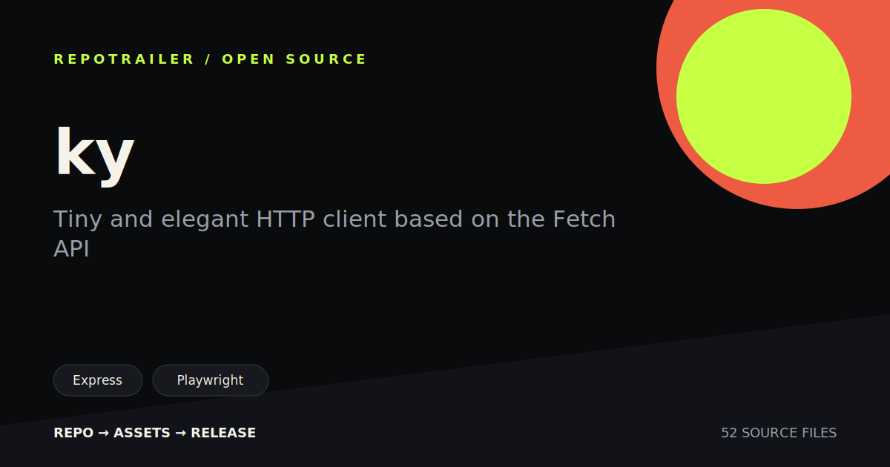
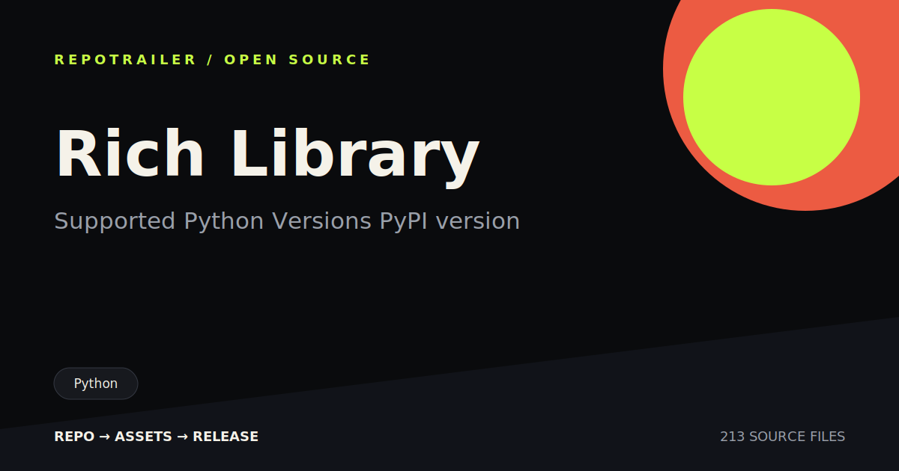
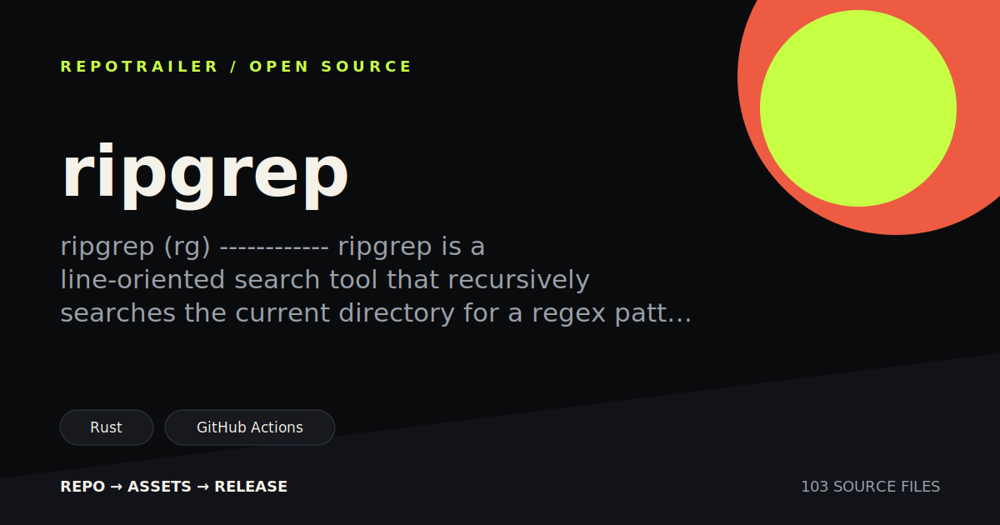

# Examples

RepoTrailer is easiest to judge visually. These cards were generated from real
public repositories with the static path:

```bash
repotrailer owner/repo --no-video
```

The examples are included as lightweight SVG assets so the repository stays
small and npm installs stay fast.

## ky

Tiny and elegant HTTP client based on the Fetch API.

Source: <https://github.com/sindresorhus/ky>



## Rich

Terminal formatting and rich text for Python.

Source: <https://github.com/Textualize/rich>



## ripgrep

Fast recursive search from the command line.

Source: <https://github.com/BurntSushi/ripgrep>



## Notes

- These examples use repository facts only.
- They do not claim endorsement from the upstream projects.
- They intentionally avoid stars, downloads, or benchmark claims.
